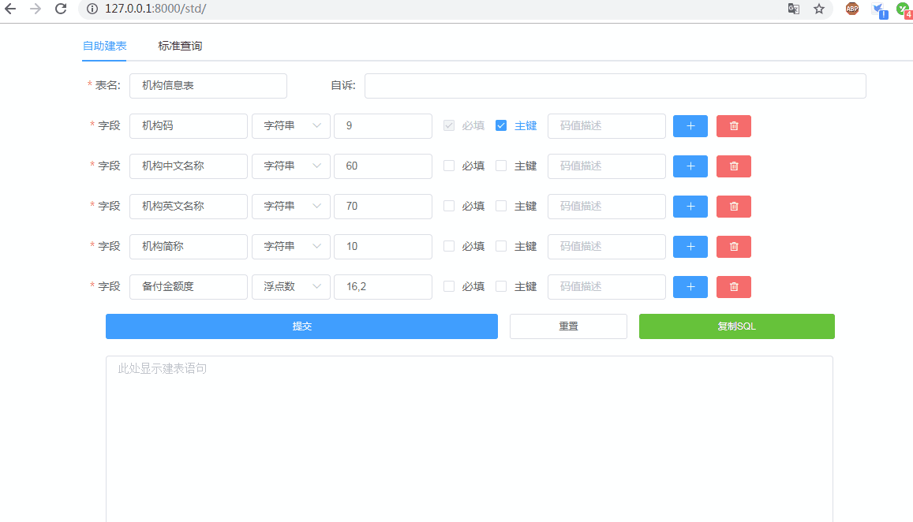

# 数据治理、数据标准相关的小工具

## 目前已开发的功能：

1. 添加或修改数据标准，包含数据项的中文描述，英文代码，英文全称，码值说明。
2. 根据提供的中文字段名，利用 jieba 分词，自动检索数据标准，据数据标准生成符合标准的建表语句。

## 界面展示：



## 采用的技术栈：
1. 后端：Django, Django rest framework，jieba
2. 前段: Vue,  Element-ui, axios 

## 如果项目对你有帮助，请给个星，开发环境部署步骤：

```shell
git clone https://github.com/somenzz/DataStandard.git

cd DataStandard

pip install -r requirements.txt

python manage.py runserver 0.0.0.0:8000

```

然后打开浏览器，在地址栏上输入 ：http://127.0.0.1:8000/std 即可访问并试用。

**在添加或修改数据标准时需要登陆难**，初始用户名 admin 密码 admin8888，你也可以通过以下命令自行添加用户：

```python
python manage.py createsuperuser
```


## 与我一起交流 Python ：

微信号: somenzz

关注微信公众号： somenzz

